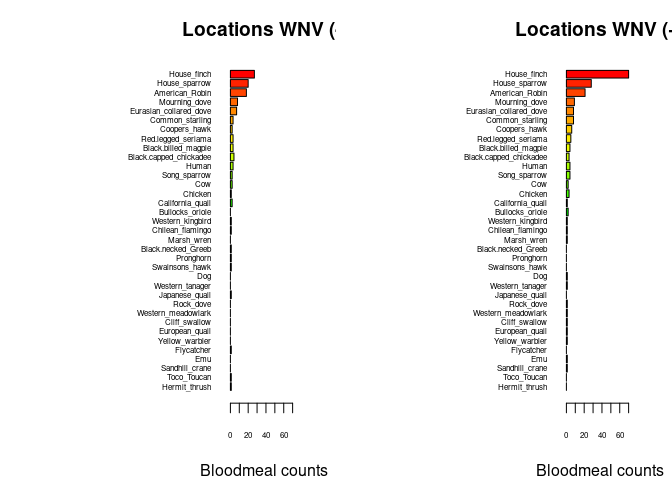

Warm-up mini-Report: Mosquito Blood Hosts in Salt Lake City, Utah
================
Trenton Blais
2025-10-04

- [ABSTRACT](#abstract)
- [BACKGROUND](#background)
- [STUDY QUESTION and HYPOTHESIS](#study-question-and-hypothesis)
  - [Questions](#questions)
  - [Hypothesis](#hypothesis)
  - [Prediction](#prediction)
- [METHODS](#methods)
  - [Fill in first analysis](#fill-in-first-analysis)
  - [Fill in second analysis/plot](#fill-in-second-analysisplot)
- [DISCUSSION](#discussion)
  - [Interpretation - Bloodmeal Bar
    plot](#interpretation---bloodmeal-bar-plot)
  - [Interpretation - Linear model and
    p-value](#interpretation---linear-model-and-p-value)
- [CONCLUSION](#conclusion)
- [REFERENCES](#references)

# ABSTRACT

We know that House Finches are a species of bird that West Nile Virus
viremia tends to persist in, and we propose that House Finches are also
involved in the amplification of the virus as well. Our data shows a
significant correlation between the number of mosquito blood meals from
House Finches and the rate at which WNV is present in mosquito blood
meals. Additionally, we found that in the Salt Lake City area mosquitoes
get blood meals from House Finches more than any other bird, further
highlighting their potential importance as primary amplifiers of West
Nile Virus in the Salt Lake City region.

# BACKGROUND

West Nile Virus is harmful virus that is transmitted from birds to
humans via a mosquito vector. A previous study found that viremia stays
in the bloodstream of the house finch for quite a long time compared to
other birds (Komar et al., 2003) as the figure below details. This could
have major implications in the amplification of West Nile Virus if
mosquitoes often get blood meals from the house finch. In this study, we
will look to answer that very question.

``` r
# Manually transcribe duration (mean, lo, hi) from the last table column
duration <- data.frame(
  Bird = c("Canada Goose","Mallard", 
           "American Kestrel","Northern Bobwhite",
           "Japanese Quail","Ring-necked Pheasant",
           "American Coot","Killdeer",
           "Ring-billed Gull","Mourning Dove",
           "Rock Dove","Monk Parakeet",
           "Budgerigar","Great Horned Owl",
           "Northern Flicker","Blue Jay",
           "Black-billed Magpie","American Crow",
           "Fish Crow","American Robin",
           "European Starling","Red-winged Blackbird",
           "Common Grackle","House Finch","House Sparrow"),
  mean = c(4.0,4.0,4.5,4.0,1.3,3.7,4.0,4.5,5.5,3.7,3.2,2.7,1.7,6.0,4.0,
           4.0,5.0,3.8,5.0,4.5,3.2,3.0,3.3,6.0,4.5),
  lo   = c(3,4,4,3,0,3,4,4,4,3,3,1,0,6,3,
           3,5,3,4,4,3,3,3,5,2),
  hi   = c(5,4,5,5,4,4,4,5,7,4,4,4,4,6,5,
           5,5,5,7,5,4,3,4,7,6)
)

# Choose some colors
cols <- c(rainbow(30)[c(10:29,1:5)])  # rainbow colors

# horizontal barplot
par(mar=c(5,12,2,2))  # wider left margin for names
bp <- barplot(duration$mean, horiz=TRUE, names.arg=duration$Bird,
              las=1, col=cols, xlab="Days of detectable viremia", xlim=c(0,7))

# add error bars
arrows(duration$lo, bp, duration$hi, bp,
       angle=90, code=3, length=0.05, col="black", xpd=TRUE)
```


To determine what mosquitoes preyed on most, we used PCR to amplify the
DNA from their last blood meal and sequenced it determine the species.
PCR stands for Polymerase Chain Reaction, and is a incredibly useful
tool for amplifying DNA. Through a mixture of nucleotides, primers, and
polymerases, PCR denatures, anneals, and extends the original DNA from a
few strands to millions. As it undergoes cyclic heating and cooling, the
DNA is amplified allowing for very simple genome sequencing. That all
being said, why is it important for us to go through the effort of PCR
and sequencint find out which birds are being preyed on the most?

Well, that is answered in a different study conducted in 2020. In this
study they trapped mosquitoes in close proximity to Robin roosts (a
common WNV amplifier) and other mosquitoes without Robin roosts. The
results were quite alarming! They found a 23-fold increase in vector to
vertebrate contacts in one area and in another area, they went from
having 0 vector mosquitoes to almost 40,000 within a month (Komar et
al., 2020)! Once the mosquitoes get a blood meal from an infected bird,
they can very easily move on to a human and potentially infect them as
well. Thus, we want to determine the mosquitoes that contain WNV and
their most recent blood meals to determine if a bird such as the House
Finch is acting as a similar amplifier for Salt Lake City.

# STUDY QUESTION and HYPOTHESIS

## Questions

What bird species is acting as an amplifying host of West Nile Virus in
Salt Lake City?

## Hypothesis

Because House Finches are in close proximity to humans, they act as
important amplifying hosts of WNV in Salt Lake City.

## Prediction

If House Finches are acting as important amplifying hosts, we predict
that we will find higher rates of West Nile Virus in the mosquitoes at
the trap locations where they feed on House Finches most often.

# METHODS

To determine where mosquitoes were getting blood meals from, and if
their hosts were infected, we trapped many mosquitoes within Salt Lake
City, and sequenced their blood meals. Once the mosquitoes were trapped,
and the ones with the blood meal separated, we crushed them up to get to
the blood of their last meal in order to initiate PCR. Once we crushed
up the mosquito blood mixture, we added a master mix. The master mix is
composed of various amounts of water, buffers, and polymerases (such as
taq polymerase) that are critical for a successful PCR. We also added in
a highly conserved DNA template that the amplifying genetic material in
PCR bound to. Finally, we put it into a thermocycler, which in
alternating settings of heat and cool accelerated the amplification
process of the target DNA.

Once the PCR was finished, we sequenced the genomes of all the
mosquitoes’ blood meals and found a wide range of blood meals from house
finches to flamingos to humans. Using this data, we compared the blood
meals between hosts positive for West Nile Virus and hosts negative to
West Nile Virus. Using this information we were able to come to
conclusions about which host species was most likely to act as a
amplifying host of West Nile Virus.

## Fill in first analysis

``` r
## import counts_matrix: data.frame with column 'loc_positives' (0/1) and host columns 'host_*'
counts_matrix <- read.csv("./bloodmeal_plusWNV_for_BIOL3070.csv")

## 1) Identify host columns
host_cols <- grep("^host_", names(counts_matrix), value = TRUE)

if (length(host_cols) == 0) {
  stop("No columns matching '^host_' were found in counts_matrix.")
}

## 2) Ensure loc_positives is present and has both levels 0 and 1 where possible
counts_matrix$loc_positives <- factor(counts_matrix$loc_positives, levels = c(0, 1))

## 3) Aggregate host counts by loc_positives
agg <- stats::aggregate(
  counts_matrix[, host_cols, drop = FALSE],
  by = list(loc_positives = counts_matrix$loc_positives),
  FUN = function(x) sum(as.numeric(x), na.rm = TRUE)
)

## make sure both rows exist; if one is missing, add a zero row
need_levels <- setdiff(levels(counts_matrix$loc_positives), as.character(agg$loc_positives))
if (length(need_levels)) {
  zero_row <- as.list(rep(0, length(host_cols)))
  names(zero_row) <- host_cols
  for (lv in need_levels) {
    agg <- rbind(agg, c(lv, zero_row))
  }
  ## restore proper type
  agg$loc_positives <- factor(agg$loc_positives, levels = c("0","1"))
  ## coerce numeric host cols (they may have become character after rbind)
  for (hc in host_cols) agg[[hc]] <- as.numeric(agg[[hc]])
  agg <- agg[order(agg$loc_positives), , drop = FALSE]
}

## 4) Decide species order (overall abundance, descending)
overall <- colSums(agg[, host_cols, drop = FALSE], na.rm = TRUE)
host_order <- names(sort(overall, decreasing = TRUE))
species_labels <- rev(sub("^host_", "", host_order))  # nicer labels

## 5) Build count vectors for each panel in the SAME order
counts0 <- rev(as.numeric(agg[agg$loc_positives == 0, host_order, drop = TRUE]))
counts1 <- rev(as.numeric(agg[agg$loc_positives == 1, host_order, drop = TRUE]))

## 6) Colors: reuse your existing 'cols' if it exists and is long enough; otherwise generate
if (exists("cols") && length(cols) >= length(host_order)) {
  species_colors <- setNames(cols[seq_along(host_order)], species_labels)
} else {
  species_colors <- setNames(rainbow(length(host_order) + 10)[seq_along(host_order)], species_labels)
}

## 7) Shared x-limit for comparability
xmax <- max(c(counts0, counts1), na.rm = TRUE)
xmax <- if (is.finite(xmax)) xmax else 1
xlim_use <- c(0, xmax * 1.08)

## 8) Plot: two horizontal barplots with identical order and colors
op <- par(mfrow = c(1, 2),
          mar = c(4, 12, 3, 2),  # big left margin for species names
          xaxs = "i")           # a bit tighter axis padding

## Panel A: No WNV detected (loc_positives = 0)
barplot(height = counts0,
        names.arg = species_labels, 
        cex.names = .5,
        cex.axis = .5,
        col = rev(unname(species_colors[species_labels])),
        horiz = TRUE,
        las = 1,
        xlab = "Bloodmeal counts",
        main = "Locations WNV (-)",
        xlim = xlim_use)

## Panel B: WNV detected (loc_positives = 1)
barplot(height = counts1,
        names.arg = species_labels, 
        cex.names = .5,
        cex.axis = .5,
        col = rev(unname(species_colors[species_labels])),
        horiz = TRUE,
        las = 1,
        xlab = "Bloodmeal counts",
        main = "Locations WNV (+)",
        xlim = xlim_use)
```

<!-- -->

``` r
par(op)

## Keep the colors mapping for reuse elsewhere
host_species_colors <- species_colors
```

This bar graph compares the positive and negative WNV bloodmeal results.
It shows the House Finch, House Sparrow and American Robin are the three
birds mosquitoes most often got a blood meal from, and the House Finch
especially tests high in positive WNV. A side note for clarification the
bar graph on the right is the one showing positive WNV results, while
the left side is negative.

## Fill in second analysis/plot

``` r
# second-analysis-or-plot, glm with house finch alone against binary +/_
glm1 <- glm(loc_positives ~ host_House_finch,
            data = counts_matrix,
            family = binomial)
summary(glm1)
```

    ## 
    ## Call:
    ## glm(formula = loc_positives ~ host_House_finch, family = binomial, 
    ##     data = counts_matrix)
    ## 
    ## Coefficients:
    ##                  Estimate Std. Error z value Pr(>|z|)  
    ## (Intercept)       -0.1709     0.1053  -1.622   0.1047  
    ## host_House_finch   0.3468     0.1586   2.187   0.0287 *
    ## ---
    ## Signif. codes:  0 '***' 0.001 '**' 0.01 '*' 0.05 '.' 0.1 ' ' 1
    ## 
    ## (Dispersion parameter for binomial family taken to be 1)
    ## 
    ##     Null deviance: 546.67  on 394  degrees of freedom
    ## Residual deviance: 539.69  on 393  degrees of freedom
    ## AIC: 543.69
    ## 
    ## Number of Fisher Scoring iterations: 4

``` r
#glm with house-finch alone against positivity rate
glm2 <- glm(loc_rate ~ host_House_finch,
            data = counts_matrix)
summary(glm2)
```

    ## 
    ## Call:
    ## glm(formula = loc_rate ~ host_House_finch, data = counts_matrix)
    ## 
    ## Coefficients:
    ##                  Estimate Std. Error t value Pr(>|t|)    
    ## (Intercept)      0.054861   0.006755   8.122 6.07e-15 ***
    ## host_House_finch 0.027479   0.006662   4.125 4.54e-05 ***
    ## ---
    ## Signif. codes:  0 '***' 0.001 '**' 0.01 '*' 0.05 '.' 0.1 ' ' 1
    ## 
    ## (Dispersion parameter for gaussian family taken to be 0.01689032)
    ## 
    ##     Null deviance: 6.8915  on 392  degrees of freedom
    ## Residual deviance: 6.6041  on 391  degrees of freedom
    ##   (2 observations deleted due to missingness)
    ## AIC: -484.56
    ## 
    ## Number of Fisher Scoring iterations: 2

To further support our hypothesis we ran this linear statistical model
to test if the presence of house finches would also increase the rate of
positive WNV tests. The results show a significant p-value of 0.0287 in
support of our hypothesis.

# DISCUSSION

The above data and statistics absolutely support our hypothesis that
House Finches act as an amplifier of West Nile Virus in Salt Lake City.
House Finches were one of the most common blood meals for mosquitoes,
and they were the only ones to have significantly more positive counts
of viremia than any other host, supporting our prediction. Further
detail on how the data supports our hypothesis is listed in the
interpretations sections.

## Interpretation - Bloodmeal Bar plot

The bar plot gives us a lot of great information. It shows the
approximate number of blood meals from each species found and if the
hosts of those blood meals were positive for WNV. The results show that
the House Finch, House Sparrow, and Robin were the three most common
blood meals in general. The latter two show about the same amount of
positive and negative hosts, implying they are a more random and
inconsistent amplifier. Blood meals from House Finches, on the other
hand, showed a drastic increase in positive WNV cases highlighting their
potential importance for amplification of the disease.

## Interpretation - Linear model and p-value

The linear statistical model we ran afterwards supported this
amplification hypothesis as well. We compared the number of House Finch
blood meals to the rate of positive WNV sites, and found of p-value of
0.0287. This suggests that there is less than a 3% chance this
correlation is strictly due to chance, and is a further support to our
hypothesis that House Finches could be a primary amplifier of West Nile
Virus in Salt Lake City area.

# CONCLUSION

In conclusion, we can say with surety that House Finches can act as an
amplifier of West Nile Virus, and are also a common target for
mosquitoes. The information in this study can be especially helpful to
abatement groups, who can look to target areas with strong House Finch
populations. That being said, this study is limited to correlation and
cannot prove causation that House Finches alone are the cause for cases
of WNV in humans or other mammals in Salt Lake City. Future studies will
need to occur to determine causality. One hypothetical study can look
into the genome of viral strains to determine if their is a particular
type of viral strain that House Finches specifically contract. If that
is the case, mammals and humans who contract WNV could then be tested
for the House Finch strain to determine if further action needs to be
taken to mitigate their potential risk.

# REFERENCES

1.  Komar N, Langevin S, Hinten S, Nemeth N, Edwards E, Hettler D, Davis
    B, Bowen R, Bunning M. Experimental infection of North American
    birds with the New York 1999 strain of West Nile virus. Emerg Infect
    Dis. 2003 Mar;9(3):311-22. <https://doi.org/10.3201/eid0903.020628>

2.  Komar, N., Panella, N. A., & Burkhalter, K. L. (2018, December).
    Focal amplification and suppression of West Nile virus transmission
    associated with communal bird roosts in Northern Colorado. Journal
    of vector ecology : journal of the Society for Vector Ecology.
    <https://pmc.ncbi.nlm.nih.gov/articles/PMC7083205/>

3.  ChatGPT. OpenAI, version Jan 2025. Used as a reference for functions
    such as plot(viremia) and to correct syntax errors. Accessed
    2025-10-04.
